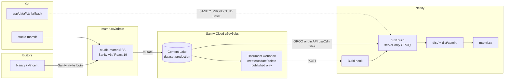
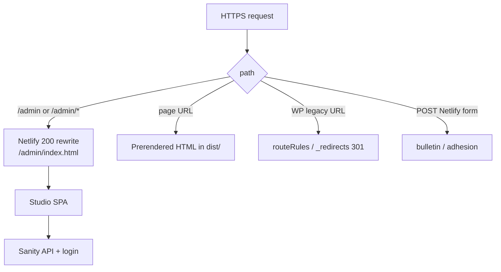
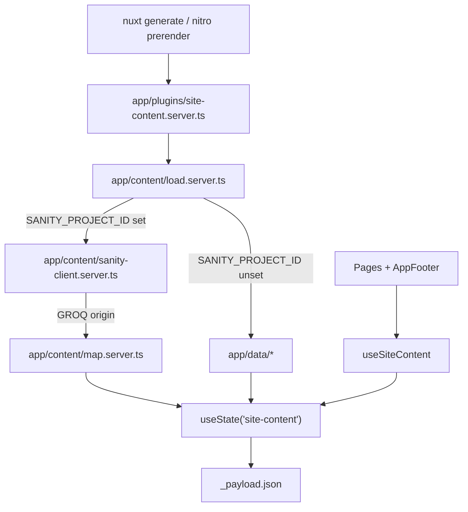
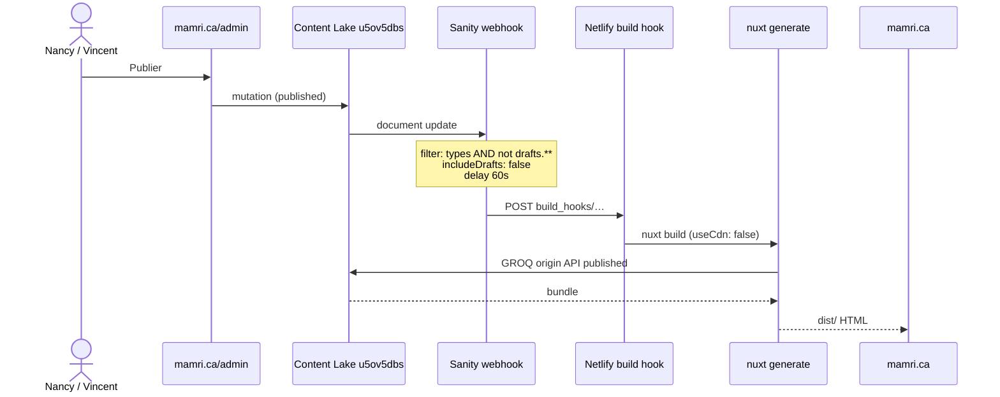

# Sanity CMS for mamri.ca

| | |
|---|---|
| **Author** | Grok / MRI site rebuild |
| **Date** | 2026-09-10 |
| **Status** | Draft (open questions resolved) |
| **Audience** | Implementer + reviewer (senior engineers who know this repo) |
| **Workspace** | `/home/raphe/Documents/Code/mamri` |
| **Sanity project** | `u5ov5dbs` / dataset `production` (already in `studio-mamri/`) |
| **Project owner** | Implementer’s Sanity account. MRI staff (Nancy, Vincent) are Editors. Transfer ownership to MRI at handover. |
| **Blocked on** | Implementer inviting Nancy/Vincent as Editors, CORS + Netlify env at cutover — **not** creating a new project |

---

## Overview

The MRI site is a Nuxt 4 + Tailwind CSS v3 static site on Netlify (`nitro.preset: 'netlify'`, `prerender.crawlLinks: true`). Copy lives in typed modules under `app/data/` (README: “prêts à être branchés plus tard sur un CMS”). Nancy Element and Vincent Camiré (~2 staff) currently edit mamri.ca through WordPress `/wp-admin` on the same domain. They will not get a page builder, a Node CMS server, or a `*.sanity.studio` primary URL.

The workspace already contains a Sanity v6 Studio at `studio-mamri/` (`sanity@^6.13.1`, React 19, `projectId: 'u5ov5dbs'`, `dataset: 'production'`, empty `schemaTypes`, `deployment.autoUpdates: true`). This design **extends that package and that Content Lake**. It does not `sanity init` a second project.

Public site stays a prerendered static generate. A **server-only** plugin fetches published documents at `nuxt generate` / `nuxt build`, maps them 1:1 onto `app/types/content.ts`, and writes `useState('site-content')` so each page payload hydrates. Vue SFCs call `useSiteContent()`, which **only** reads that state — they never import `@sanity/client`, `loadSiteContent`, or `useAsyncData(() => loadSiteContent())`. On publish, a Sanity **webhook** (not a Sanity Function — a bare POST needs no document shaping) fires a Netlify build hook.

Until `SANITY_PROJECT_ID` is set in the **Netlify / generate environment**, the server loader keeps returning `app/data/`. Forms (Netlify bulletin/membership, Zoho enquête and Backstage ticketing) stay out of the CMS.

v1 is the content MRI changes week to week: **site settings (bandeau, contact, Zoho enquête URL), activités, logos + portraits de membres, équipe**. v2 is page-copy singletons. Navigation, legal, tariffs, design tokens, and WordPress 301s stay in git.

---

## Background & Motivation

### Current state

- **Stack:** Nuxt 4.5 (`nuxt.config.ts`), Vue 3, Tailwind v3, `@nuxt/image` installed but unused (pages use native ``), Node 22 on Netlify (`netlify.toml`). `.gitignore` already ignores `.env` / `.env.*` and keeps `!.env.example`.
- **Deploy:** `package.json` `"build": "nuxt build"`; `netlify.toml` `command = "npm run build"`, `publish = "dist"`, `NODE_VERSION = "22"`, plus existing `[[headers]]` for `X-Frame-Options: SAMEORIGIN`, `X-Content-Type-Options: nosniff`, `Referrer-Policy: strict-origin-when-cross-origin`. Nitro prerenders from `/` with `crawlLinks: true`. `routeRules` plus `public/_redirects` preserve ~20 WordPress URL 301s — **keep them**.
- **Watchers:** `nuxt.config.ts` already `ignore`s / chokidar-ignores `Current/**`, `dist/**`, `.netlify/**`. `studio-mamri/` must be added to the same lists so Studio’s `node_modules` does not stall Nuxt polling.
- **Content:** 11 TS modules, consumed by 18 pages and 2 layout components via 29 `import { … } from '~/data/…'`. `app/composables/` and `app/server/api/` are empty. **CMS code already exists as an empty Studio**, not as Nuxt wiring.
- **Existing Studio:** `/home/raphe/Documents/Code/mamri/studio-mamri/` — Sanity v6 (`sanity@^6.13.1`, `@sanity/vision@^6.13.1`, `styled-components@^6.1.18`, React 19). `sanity.config.ts` and `sanity.cli.ts` both pin `projectId: 'u5ov5dbs'`, `dataset: 'production'`. CLI uses `deployment: { autoUpdates: true }` (no `project.basePath`, no `studioHost`, no Vite `outDir`). `schemaTypes/index.ts` exports `[]`. Own `package-lock.json`.
- **Language / type:** `htmlAttrs.lang = 'fr-CA'`. Public typeface is **Roboto only** (`nuxt.config.ts` Google Fonts link; `tailwind.config.ts` maps `fontFamily.sans`, `.serif`, and `.roboto` all to Roboto).
- **Editors:** two people used to French `/wp-admin` on the same hostname.

### Pain points this solves

1. Every bandeau, event, logo, or team change is a git commit + Netlify deploy by the implementer.
2. MRI cannot be handed the site as a WordPress replacement without an editor UI they can bookmark as `mamri.ca/admin`.
3. Event copy changes every season; **14** `EventItem`s live in `app/data/events.ts`.
4. Member logos (**60** rows in `memberLogos[]`; 61 files on disk if you count unused `public/images/members/interfonction.bmp`) and **10** spotlights need to be addable without touching the repo.

### What this must not become

MRI just left Elementor. A Portable Text page builder, a mounted React Studio inside a Vue page, a second Sanity project, `@nuxtjs/sanity` live queries in the browser, or a Node CMS process on Netlify would undo the rebuild’s constraints.

---

## Goals & Non-Goals

### Goals

- Give Nancy and Vincent a **French Studio UI** (schema labels **and** `@sanity/locale-fr-fr`) at `https://mamri.ca/admin` (full viewport, no `AppHeader` / `AppFooter`).
- Keep the public site a prerendered static Nuxt app on Netlify.
- Map Sanity documents 1:1 onto `app/types/content.ts` so section components (`EventCard`, `EventTeaser`, `LogoGrid`, `AnnouncementBar`) keep their current props.
- Fetch Sanity **only on the server at generate time**; hydrate pages/layout from the Nuxt payload.
- v1 editable: settings (announcement bar including `enabled`, contact, `zohoEnquete`) + events + member logos + member spotlights + team.
- One-shot seed from `app/data/*.ts` and referenced `public/images/`, with `sortIndex` preserved from array order.
- Fallback: if `SANITY_PROJECT_ID` is unset at generate, keep serving `app/data/`.
- `robots.txt` Disallow `/admin`. No public nav link.
- Auth via Sanity project invites on **`u5ov5dbs`** (Editor for staff, Administrator for implementer).

### Non-goals (v1)

- Page builder / Portable Text layout blocks / Elementor-style sections.
- Rebuilding Zoho Backstage ticketing or Zoho enquête forms inside Sanity.
- Netlify Forms (`bulletin`, `adhesion` in `MembershipForm.vue` / `bulletin.vue`) moving into Sanity.
- Editing `app/data/nav.ts`, `legal.ts`, `tariffs.ts`, design tokens, or the WordPress 301 table in the CMS.
- Mounting React Studio inside a Nuxt/Vue page.
- Adding `@nuxtjs/sanity` (it pulls client-side `useSanityQuery` into Vue; we only want `@sanity/client` on the server).
- Live preview / Presentation / draft overlay on mamri.ca (phase 2).
- A custom user table or WordPress user migration.
- i18n of **site content** beyond `fr-CA` (French-only site). Studio UI uses the `fr-FR` locale pack (no `fr-CA` pack exists).
- Generating a real `sitemap.xml`.
- Switching public `` tags to `<NuxtImg>`.
- Creating a second Sanity project, or replacing `studio-mamri/` with a greenfield `studio/` package.
- Putting `depVideo` in v1 settings (the DEP iframe still reads `depPage.video.src` in `app/data/projects.ts` until v2).

---

## Key Decisions

1. **CMS = Sanity (hosted Content Lake), not WordPress headless / Storyblok / in-app Strapi.** Matches the typed document model and keeps the public site static.

2. **Reuse `studio-mamri/` and project `u5ov5dbs` / `production`.** `schemaTypes` is empty; we fill it. Do not `sanity init`, do not add a sibling `studio/` package, do not create a second Content Lake. The project is owned by the **implementer’s** Sanity account; MRI staff are Editors. Transfer ownership to MRI at handover. Nested-package isolation is already true (own lockfile, React 19, Sanity v6).

3. **Primary editor door is `mamri.ca/admin`, not `*.sanity.studio`.** `npx sanity deploy` from `studio-mamri/` remains break-glass (`deployment.autoUpdates: true` already in `sanity.cli.ts`).

4. **Two builds, one domain — but not on production Netlify until cutover.** Nuxt (Vue) → `dist/`. Studio (React + Vite, **Sanity v6 already in tree**) → `dist/admin/` via `SANITY_STUDIO_BASEPATH=/admin sanity build ../dist/admin --yes`. Workspace `defineConfig.basePath` is **omitted** (defaults to `/`). The official env `SANITY_STUDIO_BASEPATH` is the studio/asset prefix and is set **only on the Netlify studio build** so CLI + workspace paths are not joined into `/admin/admin`. Local `sanity dev` stays `http://localhost:3333/`; break-glass `sanity deploy` stays `https://mamri.sanity.studio/`. Netlify SPA rewrites `/admin` and `/admin/*` → `/admin/index.html` 200 land in the **cutover PR**, not before. Do **not** mount `<Studio>` inside a Nuxt page. Confirm by inspecting `dist/admin/index.html` asset hrefs (`/admin/static/…`, not `/static/…`).

5. **Documents only, no page builder.** Event dates stay **display strings** (`startLabel`, `timeLabel`) because real data includes ranges (“17 et 24 septembre 2026”, “Du 7 octobre au 16 décembre 2026”).

6. **Static generate + webhook, not a Node CMS server, not a Sanity Function.** A bare POST to a Netlify build hook needs no document shaping — Functions skill: that is a webhook. Filter published documents only.

7. **Server-only adapter; public runtime never talks to Sanity.** All Sanity/map/client imports live in `app/content/*.server.ts` and are imported **only** from `app/plugins/site-content.server.ts` via `~~/app/content/load.server`. That plugin writes `useState('site-content')` once per generate (`let memo` in the loader). `useSiteContent()` **only** reads `useState('site-content')` and throws if empty — it must not import `loadSiteContent`, must not call `useAsyncData`, and must not touch `@sanity/client`. Vite does not tree-shake a `useAsyncData(() => loadSiteContent())` handler out of a composable imported by `.vue` files. `SANITY_PROJECT_ID` is unprefixed (not `NUXT_PUBLIC_`). `SANITY_READ_TOKEN` is unprefixed and optional (public dataset). Do not put the client in Nitro `server/utils/` and import it from a Vue composable (Nuxt 4 gray area).

8. **Adapter shapes, not page rewrites.** Mapped objects match `app/data/` (`EventItem`, `MemberLogo`, …). Components that already take those props stay put. Vue wrapper name: `useSiteContent`. Server loader name: `loadSiteContent`.

9. **Phased schema.** v1 = `siteSettings` + `event` + `memberLogo` + `memberSpotlight` + `teamMember`. v2 = page singletons. Nav, legal, tariffs, redirects stay in git.

10. **Env-gated fallback.** Unset `SANITY_PROJECT_ID` at generate ⇒ `app/data/` (and `runtimeConfig.public.zoho*` defaults). The project ID is already in `studio-mamri/`; **Nuxt must not default to it**, or an empty dataset would ship on the next production build. Once the env var is set, empty v1 collections **fail the build**.

11. **Sanity invites for auth** on `u5ov5dbs`. The implementer owns the project and remains Administrator. The implementer invites Nancy Element and Vincent Camiré as **Editors**. Transfer project ownership to MRI at handover. Standard roles (Administrator / Editor / Viewer) exist on the free plan; custom role-builder is a Growth+ feature and is **not** assumed. Vision is hidden from non-administrators via `tools` filter on `currentUser.roles`.

12. **Typography stays Roboto.** No CMS field for font family.

13. **French Studio: schema titles + `@sanity/locale-fr-fr`.** English `_type` names (`event`, not `activite`). Site content remains `fr-CA`.

14. **Images migrate to the Sanity CDN via `@sanity/image-url` in the server mapper.** Hotspot **off** for logos (contain / no crop); hotspot **on** for spotlights and team (`object-cover` in Vue). Files stay in `public/` as rollback until a later cleanup PR.

15. **TypeGen is the GROQ contract; `app/types/content.ts` is the public UI contract.** `defineQuery` + `studio-mamri/sanity.cli.ts` `typegen` scanning `../app/**/*.{ts,vue}` generating `../app/content/sanity.types.ts`. `map.server.ts` converts GROQ result → `SiteContent`.

16. **Generate-time client uses `useCdn: false` + `perspective: 'published'`.** CDN (~60s) plus a 60s webhook delay would publish stale HTML. There is no browser Sanity client in v1, so CDN has no role.

17. **Events are a vitrine, not a shop.** `href` required (mostly `mri.zohobackstage.com`). External URL fields allow `http` **and** `https` (16 current member/spotlight hrefs are `http://`).

18. **Preview is phase 2.**

19. **Ordinary documents get Sanity-generated `_id`s.** Only `siteSettings` has a fixed id (`siteSettings`). Seed looks up collections by `importKey` (slug / kebab name) and `createIfNotExists` / patch; it does not mint slug-derived `_id`s. `importKey` is hidden/readOnly and **import-only** — do not re-run seed after editors create documents (those docs have no key; `--force` would duplicate).

---

## Proposed Design

### High-level architecture



### Request path (public vs admin)



`app/layouts/default.vue` always wraps pages in `AppHeader` + `AppFooter`. `/admin` is **not a Nuxt route**, so that layout never runs. Do not add `app/pages/admin.vue`.

### Repository layout

Keep the existing Studio path. Do not introduce a second package.

```
mamri/
  app/                              # Nuxt 4 (Vue)
    content/
      sanity.queries.ts             # defineQuery only (no client)
      sanity.types.ts               # TypeGen output (committed)
      sanity-client.server.ts       # @sanity/client, useCdn: false
      map.server.ts                 # GROQ → SiteContent; urlFor
      load.server.ts                # loadSiteContent / fromStatic / assertV1 / memo
      snapshot.ts                   # optional generated JSON
    composables/
      useSiteContent.ts             # useState('site-content') ONLY
    plugins/
      site-content.server.ts        # the only module that imports load.server
    data/                           # fallback + seed source
    types/content.ts                # public UI contract (unchanged)
  studio-mamri/                     # EXISTING Sanity v6 package
    sanity.config.ts                # locale, structure, tools, newDocumentOptions
                                    # NO workspace basePath (omit or '/')
    sanity.cli.ts                   # + typegen; keep deployment.autoUpdates
                                    # NO project.basePath
    schemaTypes/                    # fill the empty array
    structure.ts
  scripts/
    seed-sanity.ts
    dump-snapshot.ts
```

`@sanity/client`, `groq`, and `@sanity/image-url` are **root** (Nuxt) dependencies. They are imported only from `app/content/*.server.ts`. The **only** importer of `load.server.ts` is `app/plugins/site-content.server.ts` (`import {loadSiteContent} from '~~/app/content/load.server'`). `useSiteContent.ts` and every `.vue` file import neither. `studio-mamri/package.json` stays React/Sanity-only. Do not use Nitro `server/utils/` for this — a plugin importing `~~/server/utils/…` is a Nuxt 4 gray area for the client graph.

### Studio configuration (extend what is in tree)

Current `studio-mamri/sanity.config.ts` has no `basePath`. **Keep it that way** (or set `basePath: '/'` if the CLI requires an explicit workspace path). `defineConfig.basePath` is the **workspace** path; the CLI env `SANITY_STUDIO_BASEPATH` is the **studio/asset** prefix; they are **joined**. Putting `/admin` on the workspace would yield `/admin/admin` once the Netlify env is set, and would also move break-glass `sanity deploy` to `https://mamri.sanity.studio/admin`.

```ts
import {defineConfig} from 'sanity'
import {structureTool} from 'sanity/structure'
import {visionTool} from '@sanity/vision'
import {frFRLocale} from '@sanity/locale-fr-fr'
import {schemaTypes} from './schemaTypes'
import {structure, newDocumentOptions} from './structure'

export default defineConfig({
  name: 'default',
  title: 'Maison régionale de l’industrie',
  projectId: 'u5ov5dbs',
  dataset: 'production',
  // no basePath — workspace stays '/'
  plugins: [
    structureTool({structure}),
    frFRLocale({title: 'Français'}),
    visionTool({defaultApiVersion: '2025-02-19'}),
  ],
  schema: {types: schemaTypes},
  document: {newDocumentOptions},
  tools: (prev, {currentUser}) => {
    const isAdmin = currentUser?.roles?.some((r) => r.name === 'administrator')
    return isAdmin ? prev : prev.filter((t) => t.name !== 'vision')
  },
})
```

URLs:

| Command | Env | URL |
|---|---|---|
| `sanity dev` (local) | unset | `http://localhost:3333/` |
| `sanity deploy` (break-glass) | unset | `https://mamri.sanity.studio/` |
| Netlify `sanity build ../dist/admin --yes` | `SANITY_STUDIO_BASEPATH=/admin` | assets at `/admin/static/…`, app at `https://mamri.ca/admin` |

`SANITY_STUDIO_BASEPATH` is the **official** Studio env (overrides config). Set it **only** on the Netlify studio build command, not in `sanity.cli.ts` `project.basePath` (that would also affect `sanity deploy` and `sanity dev`).

Current `studio-mamri/sanity.cli.ts` — extend, do not replace the v6 `deployment` block:

```ts
import {defineCliConfig} from 'sanity/cli'

export default defineCliConfig({
  api: {
    projectId: 'u5ov5dbs',
    dataset: 'production',
  },
  deployment: {
    autoUpdates: true,
  },
  typegen: {
    enabled: true,
    path: '../app/**/*.{ts,vue}',
    schema: 'schema.json',
    generates: '../app/content/sanity.types.ts',
    overloadClientMethods: true,
  },
})
```

Add to `studio-mamri/package.json` scripts (no basePath baked in):

```json
{
  "build": "sanity build ../dist/admin --yes",
  "typegen": "sanity schemas extract --force --enforce-required-fields && sanity typegen generate",
  "deploy-schema": "sanity schemas deploy"
}
```

Root script used only to simulate the Netlify studio build:

```json
"build:studio": "SANITY_STUDIO_BASEPATH=/admin npm --prefix studio-mamri run build"
```

`npx sanity schemas deploy` is required after PR 1 so MCP, validation, and TypeGen see the types. Self-hosted `/admin` does not deploy schema by itself.

**Do not** set CLI `project.basePath` or a Vite `outDir`. **Do not** set workspace `basePath: '/admin'`.

**Confirm after every studio build:** open `dist/admin/index.html` and check `<script>` / `<link>` hrefs. They must be `/admin/static/…` (or `/admin/assets/…`). If they are `/static/…`, `SANITY_STUDIO_BASEPATH` did not apply and the SPA will 404 on mamri.ca. If they are `/admin/admin/…`, workspace `basePath` was set and is joining with the env — remove it.

Break-glass hosted studio: `npm run deploy` already in `studio-mamri` (`sanity deploy`, no `SANITY_STUDIO_BASEPATH`). Hostname `mamri` → `https://mamri.sanity.studio/`. Keep `deployment.autoUpdates: true`. Add that origin to CORS.

### Nuxt must not prerender `/admin`

Add to `nuxt.config.ts` (can land with the adapter PR; harmless before `/admin` exists):

```ts
ignore: ['Current/**', 'dist/**', '.netlify/**', 'studio-mamri/**'],
watchers: {
  chokidar: {
    usePolling: true,
    ignored: [
      '**/node_modules/**', '**/.git/**', '**/Current/**', '**/dist/**',
      '**/.netlify/**', '**/.nuxt/**', '**/.output/**', '**/studio-mamri/**',
    ],
  },
},
nitro: {
  preset: 'netlify',
  prerender: {
    crawlLinks: true,
    routes: ['/'],
    ignore: ['/admin', '/admin/**'],
  },
},
routeRules: {
  '/admin': {prerender: false, index: false},
  '/admin/**': {prerender: false, index: false},
  // existing 301s unchanged
},
runtimeConfig: {
  // server-only — NOT under `public`
  sanityProjectId: '', // populated from SANITY_PROJECT_ID / NUXT_SANITY_PROJECT_ID
  sanityDataset: 'production',
  sanityApiVersion: '2025-02-19',
  sanityReadToken: '', // SANITY_READ_TOKEN, never public
  public: {
    siteUrl: 'https://mamri.ca',
    zohoEnquete: 'https://forms.zoho.com/emploiscomptences/form/EnqutesalarialeMRIParticipantlenqute',
    zohoBulletin: 'https://mamri.ca/abonnement-au-bulletin-de-lindustrie/',
    depVideo: 'https://drive.google.com/file/d/1vTjTnV4d0TdCkyjQ9r4VdU4ck8VKH3rk/preview',
  },
},
```

Mirror `studio-mamri/**` in `vite.server.watch.ignored` (same list that already special-cases `Current/**`).

There is no `app/pages/admin.vue`. Do not add a public nav link.

### Netlify hosting

**Today** (`netlify.toml` — keep this command until cutover):

```toml
[build]
  command = "npm run build"
  publish = "dist"

[build.environment]
  NODE_VERSION = "22"

[[headers]]
  for = "/*"
  [headers.values]
    X-Frame-Options = "SAMEORIGIN"
    X-Content-Type-Options = "nosniff"
    Referrer-Policy = "strict-origin-when-cross-origin"
```

Root `"build"` stays `"nuxt build"` so merging Studio schemas **cannot** take the public site down. Add optional scripts that production does not call yet:

```json
{
  "build": "nuxt build",
  "build:site": "nuxt build",
  "build:studio": "npm --prefix studio-mamri run build",
  "dev:studio": "npm --prefix studio-mamri run dev",
  "seed": "tsx scripts/seed-sanity.ts"
}
```

**Cutover-only** (same PR as webhook + Netlify env — see PR 4):

```toml
[build]
  command = "npm run build:site && npm --prefix studio-mamri ci && SANITY_STUDIO_BASEPATH=/admin npm --prefix studio-mamri run build"
  publish = "dist"

[build.environment]
  NODE_VERSION = "22"

[[headers]]
  for = "/*"
  [headers.values]
    X-Frame-Options = "SAMEORIGIN"
    X-Content-Type-Options = "nosniff"
    Referrer-Policy = "strict-origin-when-cross-origin"

[[headers]]
  for = "/admin"
  [headers.values]
    X-Robots-Tag = "noindex, nofollow"
    Cache-Control = "no-cache"

[[headers]]
  for = "/admin/index.html"
  [headers.values]
    X-Robots-Tag = "noindex, nofollow"
    Cache-Control = "no-cache"

[[redirects]]
  from = "/admin"
  to = "/admin/index.html"
  status = 200

[[redirects]]
  from = "/admin/*"
  to = "/admin/index.html"
  status = 200
```

Notes:

- `/admin/*` does **not** match `/admin`; both rewrites are required.
- `Cache-Control: no-cache` is **only** on the HTML shell. Hashed Studio assets under `/admin/static/` (or equivalent) keep default caching.
- `sanity build ../dist/admin --yes` writes into `dist/admin/` **after** Nuxt has produced `dist/`. It must not empty `dist/`.
- WordPress 301s in `routeRules` / `public/_redirects` never start with `/admin`.
- If Studio build must be skippable in an emergency: `SANITY_PROJECT_ID` unset → skip `build:studio` in a small wrapper. Prefer not to need this: cutover PR sets both the env and the command together.

### robots.txt

```
User-agent: *
Allow: /
Disallow: /admin
Disallow: /admin/

Sitemap: https://mamri.ca/sitemap.xml
```

No header/footer/nav link. `AppHeader` keeps `mainNav` from `app/data/nav.ts`.

### Server-only content adapter

**Fatal pattern (do not implement):**

- Pages or `AppFooter.vue` doing `await loadSiteContent()`.
- `useSiteContent.ts` calling `useAsyncData('site-content', () => loadSiteContent())`.

Any module imported from a `.vue` SFC is bundled to the client (Sanity get-started, Vite). Tree-shaking does **not** drop that handler. Top-level `await` in `<script setup>` is also **not** stored in `_payload.json`. After hydration and on client navigations those patterns GROQ from the browser.

**Required pattern:** one GROQ (or one static snapshot) per generate, inside the server plugin only.



`app/content/sanity-client.server.ts` — imported only by `load.server.ts`:

```ts
import {createClient} from '@sanity/client'

export function sanityClient() {
  const projectId = process.env.SANITY_PROJECT_ID || process.env.NUXT_SANITY_PROJECT_ID
  if (!projectId) throw new Error('SANITY_PROJECT_ID missing')
  return createClient({
    projectId,
    dataset: process.env.SANITY_DATASET || 'production',
    apiVersion: process.env.SANITY_API_VERSION || '2025-02-19',
    useCdn: false,
    perspective: 'published',
    token: process.env.SANITY_READ_TOKEN || undefined,
  })
}
```

`app/content/load.server.ts` — imported **only** by the plugin:

```ts
import {events as staticEvents} from '~/data/events'
import {memberLogos as staticLogos, memberSpotlights as staticSpotlights} from '~/data/members'
import {team as staticTeam} from '~/data/team'
import {site as staticSite} from '~/data/site'
import {home as staticHome} from '~/data/home'
import {sanityClient} from './sanity-client.server'
import {SITE_CONTENT_QUERY} from './sanity.queries'
import {mapBundle} from './map.server'
import type {EventItem, MemberLogo, MemberSpotlight, TeamMember} from '~/types/content'

export interface SiteContent {
  site: typeof staticSite
  announcement: {enabled: boolean; label: string; text: string; to: string}
  zohoEnquete: string
  zohoBulletin: string
  events: EventItem[]
  memberLogos: MemberLogo[]
  memberSpotlights: MemberSpotlight[]
  team: TeamMember[]
}

let memo: Promise<SiteContent> | null = null

export function loadSiteContent(): Promise<SiteContent> {
  if (!memo) memo = resolve()
  return memo
}

function fromStatic(): SiteContent {
  return {
    site: staticSite,
    announcement: {
      ...staticHome.announcement,
      enabled: true, // home.ts has no `enabled`; PR 2 must not hide the bandeau
    },
    zohoEnquete:
      process.env.NUXT_PUBLIC_ZOHO_ENQUETE ??
      'https://forms.zoho.com/emploiscomptences/form/EnqutesalarialeMRIParticipantlenqute',
    zohoBulletin: process.env.NUXT_PUBLIC_ZOHO_BULLETIN ?? 'https://mamri.ca/bulletin',
    events: staticEvents,
    memberLogos: staticLogos,
    memberSpotlights: staticSpotlights,
    team: staticTeam,
  }
}

function assertV1(content: SiteContent) {
  if (!content.events.length) throw new Error('[content] zero events')
  if (!content.memberLogos.length) throw new Error('[content] zero member logos')
  if (!content.team.length) throw new Error('[content] zero team members')
}

async function resolve(): Promise<SiteContent> {
  if (process.env.SANITY_FALLBACK === '1') return fromStatic()
  const projectId = process.env.SANITY_PROJECT_ID || process.env.NUXT_SANITY_PROJECT_ID
  if (!projectId) return fromStatic()

  const raw = await sanityClient().fetch(SITE_CONTENT_QUERY)
  const mapped = mapBundle(raw)
  assertV1(mapped)
  return mapped
}
```

`map.server.ts` must also default the gate so a CMS document with `enabled` missing does not hide the bar:

```ts
announcement: {
  enabled: raw.settings?.announcement?.enabled !== false,
  label: raw.settings.announcement.label,
  text: raw.settings.announcement.text,
  to: raw.settings.announcement.to,
}
```

`app/plugins/site-content.server.ts` — **only** file that imports the loader:

```ts
import {loadSiteContent} from '~~/app/content/load.server'

export default defineNuxtPlugin(async () => {
  const state = useState<SiteContent | null>('site-content', () => null)
  if (!state.value) {
    state.value = await loadSiteContent()
  }
})
```

`app/composables/useSiteContent.ts` — **zero** Sanity, map, or loader imports:

```ts
export function useSiteContent() {
  const content = useState<SiteContent | null>('site-content')
  if (!content.value) {
    throw createError({statusCode: 500, statusMessage: 'site-content missing'})
  }
  return content
}
```

One GROQ per generate: the plugin runs at prerender, `loadSiteContent()` memos, `useState` serializes into `_payload.json`, client hydrates. Do not add a second `useAsyncData` fetch.

Pages / layout:

```ts
// AppFooter.vue, contact.vue, calendrier.vue, …
const content = useSiteContent()
// content.value.site, content.value.events, …
```

`EventCard.vue` / `EventTeaser.vue` keep `import {eventTypeLabels} from '~/data/events'` — UI chrome, not CMS.

`AnnouncementBar` on `index.vue`. `fromStatic()` always sets `enabled: true`, so PR 2 does not hide the bandeau while `SANITY_PROJECT_ID` is unset (`home.announcement` today has no `enabled`):

```vue
<AnnouncementBar
  v-if="content.announcement.enabled"
  :label="content.announcement.label"
  :text="content.announcement.text"
  :to="content.announcement.to"
/>
```

Until v2, `home` hero/stats/years still come from `~/data/home` (static import from a Vue SFC is acceptable — already in the client bundle, does not pull Sanity).

**Fail closed once `SANITY_PROJECT_ID` is set.** `assertV1()` throws if events/logos/team are empty. Escape hatch: `SANITY_FALLBACK=1` reads `fromStatic()` (or `app/content/snapshot.json` if present).

### GROQ (single bundle query)

`app/content/sanity.queries.ts` — `defineQuery` so TypeGen sees it. Import `defineQuery` from `groq` (root dep). Do not import the Sanity client from this file.

```ts
import {defineQuery} from 'groq'

export const SITE_CONTENT_QUERY = defineQuery(/* groq */ `{
  "settings": *[_id == "siteSettings"][0]{
    announcement,
    name, shortName, tagline, description, founded,
    address, geo, phone, email, social, emploisCompetences,
    zohoEnquete, zohoBulletin
  },
  "events": *[_type == "event" && hidden != true && defined(slug.current)]
    | order(year asc, month asc, sortIndex asc) {
      "slug": slug.current,
      title, type, startLabel, timeLabel, location,
      memberPrice, nonMemberPrice, priceNote, tags, excerpt,
      href, month, year
    },
  "memberLogos": *[_type == "memberLogo"] | order(sortIndex asc) {
    name, href, logo, importKey
  },
  "memberSpotlights": *[_type == "memberSpotlight"] | order(sortIndex asc) {
    name, image, imageAlt, body, href, credit, featured, importKey
  },
  "team": *[_type == "teamMember"] | order(sortIndex asc) {
    name, title, image, linkedin, importKey
  }
}`)
```

Critical projections:

- `"slug": slug.current` — `EventItem.slug` is a `string` (Vue `:key`), not `{current}`.
- Settings by **fixed id**, not `*[_type == "siteSettings"][0]`.
- Images projected as image objects (asset + hotspot/crop) so `urlFor` can run in `map.server.ts`. `defined(logo.asset)` is asserted in `map.server.ts`; missing required images fail the build rather than emitting `src: undefined`.

`map.server.ts` (imported only by `load.server.ts`):

```ts
import imageUrlBuilder from '@sanity/image-url'

const builder = imageUrlBuilder({projectId, dataset})

function logoSrc(image: SanityImage) {
  if (!image?.asset) throw new Error('memberLogo missing asset')
  return builder.image(image).width(400).url()
}
function photoSrc(image: SanityImage) {
  if (!image?.asset) throw new Error('photo missing asset')
  return builder.image(image).width(1200).fit('crop').url()
}
```

Logos render at `max-h-12` (~48px, 2x = ~100px; 400px is enough). Portraits/team are `object-cover` at ~half-page; 1200px wide.

### Publish sequence



Webhook GROQ filter (copy this into Manage **and** any HTTP API):

```
_type in ["siteSettings", "event", "memberLogo", "memberSpotlight", "teamMember"]
 && !(_id in path("drafts.**"))
```

- Trigger: create, update, delete.
- Projection: `{}`.
- Delay: 60 seconds (collapses logo bursts).
- **`includeDrafts: false`** (Manage UI checkbox; default false — still set it explicitly in the runbook).
- Dataset: `production`.

A Sanity Function that only `fetch(BUILD_HOOK_URL)` is unnecessary (Functions skill: “simple POST to an external URL on publish with no document data shaping — use a webhook”).

Optional Studio tool `sanity-plugin-netlify` for a **Publier le site** button if the webhook is missed. Build hook URL is not in git.

### Draft / preview (phase 2 — not v1)

v1: drafts are invisible on the site until Publish. No Presentation, no `perspective: 'drafts'` on production.

### Studio desk (French)

`studio-mamri/structure.ts`:

```ts
import type {StructureResolver} from 'sanity/structure'
import {CogIcon} from '@sanity/icons/Cog'
import {CalendarIcon} from '@sanity/icons/Calendar'
import {UsersIcon} from '@sanity/icons/Users'
import {ImageIcon} from '@sanity/icons/Image'
import {UserIcon} from '@sanity/icons/User'

const SINGLETONS = ['siteSettings']

export const structure: StructureResolver = (S) =>
  S.list()
    .title('Contenu')
    .items([
      S.listItem()
        .title('Paramètres du site')
        .icon(CogIcon)
        .child(
          S.document()
            .schemaType('siteSettings')
            .documentId('siteSettings')
            .title('Paramètres du site'),
        ),
      S.divider(),
      S.documentTypeListItem('event').title('Activités').icon(CalendarIcon),
      S.listItem()
        .title('Membres')
        .icon(UsersIcon)
        .child(
          S.list()
            .title('Membres')
            .items([
              S.documentTypeListItem('memberLogo').title('Logos').icon(ImageIcon),
              S.documentTypeListItem('memberSpotlight').title('Portraits').icon(UsersIcon),
            ]),
        ),
      S.documentTypeListItem('teamMember').title('Équipe').icon(UserIcon),
      ...S.documentTypeListItems().filter(
        (item) =>
          !SINGLETONS.includes(item.getId() as string) &&
          !['event', 'memberLogo', 'memberSpotlight', 'teamMember'].includes(
            item.getId() as string,
          ),
      ),
    ])

export const newDocumentOptions = (prev, {creationContext}) => {
  if (creationContext.schemaType === 'siteSettings') return []
  return prev.filter((t) => t.templateId !== 'siteSettings')
}
```

Wire it on `defineConfig` as `document: {newDocumentOptions}` (Sanity’s document hook — not a top-level config key). Icons: **subpath imports** (`@sanity/icons/Cog`) — root named exports broke in v5+ and fail at bundle time.

---

## API / Interface Changes

No public HTTP API. Vue never calls Sanity.

### Pages that change in v1

All of these go through `useSiteContent()` (state), not a direct `~/data` import for the CMS-backed slices.

| File | Today | After |
|---|---|---|
| `app/pages/index.vue` | `home`, `events`, `memberLogos`, `memberSpotlights` | announcement + enabled gate, events slice(0,3), logos, featured spotlight (`featured == true` else `sortIndex` min); remainder of `home` still static until v2 |
| `app/pages/calendrier.vue` | `events` | `content.events` |
| `app/pages/membres/index.vue` | `memberSpotlights` | adapter |
| `app/pages/membres/devenir-membre.vue` | `memberLogos`, `site` | adapter for those; `membershipPage` still `~/data/about` |
| `app/pages/a-propos.vue` | `team` | adapter for team; `aboutPage` still static |
| `app/pages/contact.vue` | `site` | adapter |
| `app/pages/conditions-dutilisation.vue` | `site` (privacy officer) | **adapter** — was missing in rev 1 |
| `app/pages/services/formations.vue` | `memberLogos` | adapter |
| `app/pages/services/recrutement.vue` | `site` (`emploisCompetences`) | **adapter** — was missing in rev 1 |
| `app/pages/services/enquete-salariale.vue` | `useRuntimeConfig().public.zohoEnquete` | `content.zohoEnquete` with runtimeConfig as fallback |
| `app/components/layout/AppFooter.vue` | `site` from `~/data/site` | `useSiteContent()` (state only — **no client import of the Sanity client**) |
| `app/components/layout/AppHeader.vue` | `mainNav` | **unchanged** (git) |

`EventCard`, `EventTeaser`, `LogoGrid`, `PageHero` props do not change. `AnnouncementBar` gains a `v-if` at the call site; the component props stay `label`, `text`, `to`.

`zohoBulletin` has **no Vue consumer** today (stale WP URL, already 301s to `/bulletin` via `routeRules` / `public/_redirects`). Store it on `siteSettings` so it can be corrected, but do not invent a new page CTA. `depVideo` stays in `runtimeConfig` + `depPage.video.src` until v2.

### Env vars

| Name | Where | Public? | Purpose |
|---|---|---|---|
| `SANITY_PROJECT_ID` | Netlify + local `.env` at **cutover** | No | Feature flag + server client. Value: `u5ov5dbs`. Unset ⇒ static fallback. |
| `SANITY_DATASET` | optional | No | Default `production` |
| `SANITY_API_VERSION` | optional | No | Default `2025-02-19` |
| `SANITY_READ_TOKEN` | Netlify secret, only if dataset is privatized | No | |
| `SANITY_FALLBACK` | emergency | No | Force snapshot / `app/data/` |
| `SANITY_WRITE_TOKEN` | local `.env` only | No | Seed |
| `SANITY_STUDIO_BASEPATH` | **Netlify studio build command only** (`=/admin`) | No (build-time) | Official Studio asset prefix. Do **not** set on `sanity dev` / `sanity deploy`. |
| `NETLIFY_BUILD_HOOK_URL` | Sanity webhook UI, not git | Secret | Rebuild |

Nuxt maps `NUXT_SANITY_PROJECT_ID` → `runtimeConfig.sanityProjectId` if we keep that key — acceptable as an alias, still **not** `NUXT_PUBLIC_`. Never put the project id under `runtimeConfig.public`.

Studio `projectId` / `dataset` stay hardcoded in `studio-mamri/sanity.config.ts`. The only extra Studio env at cutover is `SANITY_STUDIO_BASEPATH=/admin` on the Netlify **studio** command.

Commit `.env.example` with empty `SANITY_PROJECT_ID=` (`.gitignore` already has `.env` / `!.env.example`).

### Studio CORS / hosts

In [manage](https://www.sanity.io/manage) for `u5ov5dbs`, CORS with credentials:

- `http://localhost:3333` (local `sanity dev` at hostname root)
- `https://mamri.ca` (self-hosted `/admin`)
- `https://mamri.sanity.studio` (break-glass `sanity deploy`; add the **exact** hostname chosen in the deploy prompt — Sanity CORS is not a `*.sanity.studio` wildcard)

---

## Data Model Changes

No application database. Public contract: `app/types/content.ts`. GROQ contract: TypeGen. Plus `sortIndex` (number) and `importKey` (string) on collections.

### Implementable Studio code (v1)

Always `defineType` / `defineField` / `defineArrayMember`. Icons from `@sanity/icons/<Name>`.

#### `siteSettings` (singleton, `_id` = `siteSettings`)

Sources: `app/data/site.ts` + `home.announcement` + `runtimeConfig.public.zohoEnquete` (and `zohoBulletin` as an unused-but-editable URL). **Not** `depVideo`.

```ts
import {defineType, defineField} from 'sanity'
import {CogIcon} from '@sanity/icons/Cog'

const urlHttpHttps = (rule) =>
  rule.uri({scheme: ['http', 'https']}).error('URL http:// ou https://')

export const siteSettings = defineType({
  name: 'siteSettings',
  title: 'Paramètres du site',
  type: 'document',
  icon: CogIcon,
  groups: [
    {name: 'bandeau', title: 'Bandeau d’annonce'},
    {name: 'coordonnees', title: 'Coordonnées'},
    {name: 'zoho', title: 'Liens Zoho'},
  ],
  fields: [
    defineField({
      name: 'announcement',
      title: 'Bandeau',
      type: 'object',
      group: 'bandeau',
      fields: [
        defineField({
          name: 'enabled',
          title: 'Afficher le bandeau',
          type: 'boolean',
          initialValue: true,
        }),
        defineField({name: 'label', title: 'Étiquette', type: 'string', validation: (r) => r.required()}),
        defineField({name: 'text', title: 'Texte', type: 'text', rows: 2, validation: (r) => r.required()}),
        defineField({
          name: 'to',
          title: 'Lien interne',
          type: 'string',
          description: 'Chemin du site, ex. /services/enquete-salariale',
          validation: (r) =>
            r.required().custom((v) =>
              typeof v === 'string' && v.startsWith('/') ? true : 'Doit commencer par /',
            ),
        }),
      ],
    }),
    defineField({name: 'name', title: 'Nom', type: 'string', group: 'coordonnees', validation: (r) => r.required()}),
    defineField({name: 'shortName', title: 'Nom court', type: 'string', group: 'coordonnees'}),
    defineField({name: 'tagline', title: 'Accroche', type: 'string', group: 'coordonnees'}),
    defineField({name: 'description', title: 'Description', type: 'text', group: 'coordonnees'}),
    defineField({name: 'founded', title: 'Année de fondation', type: 'number', group: 'coordonnees'}),
    defineField({
      name: 'address',
      title: 'Adresse',
      type: 'object',
      group: 'coordonnees',
      fields: [
        defineField({name: 'line1', title: 'Ligne 1', type: 'string'}),
        defineField({name: 'city', title: 'Ville', type: 'string'}),
        defineField({name: 'postal', title: 'Code postal', type: 'string'}),
        defineField({name: 'display', title: 'Adresse affichée', type: 'string'}),
      ],
    }),
    defineField({
      name: 'geo',
      title: 'Cartographie',
      type: 'object',
      group: 'coordonnees',
      fields: [
        defineField({name: 'lat', type: 'number'}),
        defineField({name: 'lng', type: 'number'}),
        defineField({name: 'maps', type: 'url', validation: urlHttpHttps}),
        defineField({name: 'google', type: 'url', validation: urlHttpHttps}),
        defineField({name: 'embed', type: 'url', validation: urlHttpHttps}),
      ],
    }),
    defineField({
      name: 'phone',
      title: 'Téléphone',
      type: 'object',
      group: 'coordonnees',
      fields: [
        defineField({name: 'display', type: 'string'}),
        defineField({name: 'href', type: 'string', description: 'tel:+18195665235'}),
        defineField({name: 'ext', title: 'Poste', type: 'string'}),
      ],
    }),
    defineField({
      name: 'email',
      title: 'Courriels',
      type: 'object',
      group: 'coordonnees',
      fields: [
        defineField({name: 'general', type: 'string', validation: (r) => r.email()}),
        defineField({name: 'projects', type: 'string', validation: (r) => r.email()}),
        defineField({name: 'privacy', type: 'string', validation: (r) => r.email()}),
        defineField({name: 'privacyName', type: 'string'}),
        defineField({name: 'privacyTitle', type: 'string'}),
        defineField({name: 'privacyPhone', type: 'string'}),
        defineField({name: 'communication', type: 'string', validation: (r) => r.email()}),
      ],
    }),
    defineField({
      name: 'social',
      type: 'object',
      group: 'coordonnees',
      fields: [
        defineField({name: 'facebook', type: 'url', validation: urlHttpHttps}),
        defineField({name: 'linkedin', type: 'url', validation: urlHttpHttps}),
      ],
    }),
    defineField({
      name: 'emploisCompetences',
      title: 'Emplois Compétences',
      type: 'object',
      group: 'coordonnees',
      fields: [
        defineField({name: 'name', type: 'string'}),
        defineField({name: 'url', type: 'url', validation: urlHttpHttps}),
        defineField({name: 'phone', type: 'string'}),
        defineField({name: 'phoneHref', type: 'string'}),
        defineField({name: 'email', type: 'string', validation: (r) => r.email()}),
      ],
    }),
    defineField({
      name: 'zohoEnquete',
      title: 'URL formulaire enquête salariale',
      type: 'url',
      group: 'zoho',
      validation: urlHttpHttps,
    }),
    defineField({
      name: 'zohoBulletin',
      title: 'URL bulletin (héritage)',
      type: 'url',
      group: 'zoho',
      validation: urlHttpHttps,
      description: 'Aujourd’hui inutilisée par Vue ; 301 WordPress vers /bulletin.',
    }),
  ],
  preview: {prepare: () => ({title: 'Paramètres du site'})},
})
```

No font, color, or MRI-logo fields. Brand assets stay in `public/images/logo/`.

`announcement.to` is a **string + `^/` check**, not `url` (value is `/services/enquete-salariale`).

#### `event` ↔ `EventItem`

```ts
import {defineType, defineField, defineArrayMember} from 'sanity'
import {CalendarIcon} from '@sanity/icons/Calendar'

export const event = defineType({
  name: 'event',
  title: 'Activité',
  type: 'document',
  icon: CalendarIcon,
  fields: [
    defineField({
      name: 'title',
      title: 'Titre',
      type: 'string',
      validation: (r) => r.required(),
    }),
    defineField({
      name: 'slug',
      title: 'Identifiant',
      type: 'slug',
      options: {source: 'title'},
      validation: (r) => r.required(),
    }),
    defineField({
      name: 'importKey',
      title: 'Clé d’import',
      type: 'string',
      hidden: true,
      readOnly: true,
    }),
    defineField({
      name: 'type',
      title: 'Type',
      type: 'string',
      options: {
        list: [
          {title: 'Formation', value: 'formation'},
          {title: 'Événement', value: 'evenement'},
          {title: 'Visite industrielle', value: 'visite'},
          {title: 'Webinaire', value: 'webinaire'},
        ],
        layout: 'radio',
      },
      validation: (r) => r.required(),
    }),
    defineField({name: 'startLabel', title: 'Date affichée', type: 'string', validation: (r) => r.required()}),
    defineField({name: 'timeLabel', title: 'Horaire affiché', type: 'string', validation: (r) => r.required()}),
    defineField({name: 'location', title: 'Lieu', type: 'string'}),
    defineField({name: 'memberPrice', title: 'Tarif membre', type: 'string'}),
    defineField({name: 'nonMemberPrice', title: 'Tarif non-membre', type: 'string'}),
    defineField({
      name: 'priceNote',
      title: 'Note de prix',
      type: 'string',
      description: 'Si renseignée, remplace les deux tarifs sur la carte.',
    }),
    defineField({
      name: 'tags',
      title: 'Étiquettes',
      type: 'array',
      of: [defineArrayMember({type: 'string'})],
      initialValue: [],
    }),
    defineField({name: 'excerpt', title: 'Résumé', type: 'text', validation: (r) => r.required()}),
    defineField({
      name: 'href',
      title: 'Lien d’inscription (Zoho Backstage ou page partenaire)',
      type: 'url',
      validation: (r) => r.required().uri({scheme: ['http', 'https']}),
    }),
    defineField({name: 'month', title: 'Mois (1–12)', type: 'number', validation: (r) => r.required().min(1).max(12)}),
    defineField({name: 'year', title: 'Année', type: 'number', validation: (r) => r.required()}),
    defineField({name: 'sortIndex', title: 'Ordre dans le mois', type: 'number', initialValue: 0}),
    defineField({name: 'hidden', title: 'Masquer du site', type: 'boolean', initialValue: false}),
  ],
  preview: {
    select: {title: 'title', type: 'type', start: 'startLabel'},
    prepare: ({title, type, start}) => ({
      title,
      subtitle: [type, start].filter(Boolean).join(' · '),
    }),
  },
})
```

Do **not** add Portable Text, images, tickets, or capacity. 14 seed rows from `app/data/events.ts`.

#### `memberLogo` ↔ `MemberLogo`

- `name` string required
- `href` url, `uri({scheme: ['http', 'https']})` — **https-only would fail 15 current logos**
- `logo` image, required, `options: {hotspot: false}` (contain in a white tile)
- `sortIndex` number — seed from array index `0..59`
- `importKey` hidden **readOnly** string (kebab of name) — **import-only**, not an editor field
- Preview: `{select: {title: 'name', media: 'logo', subtitle: 'href'}}`

60 documents. Skip `interfonction.bmp` (not in `memberLogos[]`).

#### `memberSpotlight` ↔ `MemberSpotlight`

- `name`, `image` (hotspot **true**, alt as sibling `imageAlt` string required — matches TS; do not nest alt only on the image or the mapper has two sources), `body` text, `href` url http/https (one spotlight is `http://milanconception.com/`), `credit` optional, `featured` boolean, `sortIndex`, `importKey`
- Seed: `sortIndex: i`, `featured: true` on **index 0** (Portable Winch — what `index.vue` uses today)

#### `teamMember` ↔ `TeamMember`

- `name`, `title`, `image` (hotspot **true**), `linkedin` url http/https, `sortIndex`, `importKey`
- Preview: name + title + image

### v2 singletons (specified now, built later)

Same nested objects as the TS modules, not a block builder: `homePage` (minus announcement), `aboutPage`, `membershipPage`, `servicesPage`, `reseauxPage`, `formationsPage`, `enquetePage`, `recrutementPage`, `depPage`, `lirePage`, `tetPage`. Nav, legal, tariffs stay in git.

### Seed / migrate

`scripts/seed-sanity.ts` (tsx + write token). Follow both playbooks:

- **Best practices:** only `siteSettings` uses a fixed `_id`. Collections: Sanity-generated ids; stable `importKey` / `slug` fields for lookup.
- **Migration:** deterministic reruns via lookup, not MCP; pause webhooks; count-check.

Algorithm:

1. Client with `SANITY_WRITE_TOKEN`, `useCdn: false`.
2. **Header comment + stdout warning:** disable the Netlify webhook in Manage (or the script deletes/recreates it) before `--force` / bulk patch. Re-enable after. A live webhook would enqueue tens of production builds.
3. `createOrReplace` `{_id: 'siteSettings', _type: 'siteSettings', ...}`. `announcement.enabled: true`. `zohoBulletin` seeded as `https://mamri.ca/bulletin` (correct the stale WP URL). Do **not** seed `depVideo` onto settings.
4. For each `events[i]`: `fetch` `*[_type=="event" && importKey==$k][0]._id` with `k = slug`; patch if found else `create` with `importKey`, `slug: {_type:'slug', current}`, `sortIndex: i`.
5. Logos: upload only paths referenced in `memberLogos[]` (60 files). `sortIndex: i`. Skip `.bmp`. Do **not** rewrite `http://` → `https://`.
6. Spotlights: 10 photos; `featured: i === 0`.
7. Team: 2 photos; `sortIndex: i`.
8. Validate and print a report: `events=14 logos=60 spotlights=10 team=2 settings=1`. Exit non-zero on mismatch.
9. Idempotent **only until editors create documents.** `importKey` is import-only. Do **not** re-run seed after Nancy/Vincent have added logos/events in Studio: new docs have no `importKey`, so a second pass cannot match them and `--force` will duplicate rows. Re-seed is a pre-cutover / disaster-recovery tool, not a sync.

`app/data/` is not deleted.

Optional `scripts/dump-snapshot.ts` writes mapped `SiteContent` JSON for `SANITY_FALLBACK=1`. Do not commit unless rollback-without-Sanity becomes a hard requirement.

---

## Alternatives Considered

### 1. WordPress headless

Rejected: the rebuild exists because WP/Elementor was the problem (constraint: Sanity).

### 2. Storyblok / Contentful / DatoCMS

Visual editors are page builders. Rejected.

### 3. Self-hosted Strapi / Directus / Payload

Rejected: no Node CMS server on Netlify.

### 4. Mount Sanity Studio inside a Nuxt page

Rejected: dual runtime, `AppHeader` leak, Sanity embedding is not the primary approach.

### 5. Hosted-only Studio at `mamri.sanity.studio`

Rejected as primary door; kept as break-glass via existing `npm run deploy` in `studio-mamri`.

### 6. Runtime fetch from the browser / `@nuxtjs/sanity`

Rejected: static host, CORS, client bundle of `@sanity/client`, fights prerender. `@nuxtjs/sanity` is the official Nuxt module but pulls `useSanityQuery` into Vue — incompatible with “public runtime never talks to Sanity.”

### 7. Singleton “mega document” per collection

Rejected: 60 logos in one document is a bad Studio UX.

### 8. Sanity Function that POSTs the Netlify hook

Rejected: no payload shaping, no extra logic — webhook is the documented choice.

### 9. Greenfield `studio/` + new project ID

Rejected: `studio-mamri/` and `u5ov5dbs` already exist.

---

## Security & Privacy Considerations

| Threat | Severity | Mitigation |
|---|---|---|
| Public `/admin` SPA shell | Medium | Mutations require Sanity login. `Disallow: /admin`, `X-Robots-Tag` on the HTML shell, no nav link. |
| Editor over-privilege | Medium | Invite as **Editor**. Vision hidden unless `administrator`. No custom paid roles assumed. `newDocumentOptions` blocks extra `siteSettings`. |
| Write token leak | High | Local `.env` only. Seed on a laptop, never Netlify. |
| Read token / project id in static JS | High | Unprefixed env, server-only modules, public dataset so generate needs no token. Do not use `NUXT_PUBLIC_SANITY_*`. |
| Webhook URL leak rebuilds production | Medium | Secret in Manage. Pause during seed. |
| XSS via CMS strings | Low–Med | Vue interpolates. Never `v-html`. `href` is `url` with `http`/`https` only (not `javascript:`). |
| Open redirects in `announcement.to` | Low | String regex must start with `/`. |
| URL validation rejecting seed | Med | Explicit `scheme: ['http', 'https']`. 15 logos + 1 spotlight are `http://`. Do not upgrade in seed. |
| CORS misconfig | Med | Only `https://mamri.ca` and `http://localhost:3333` with credentials. |
| PII in CMS | Low | Public org copy. Membership PII stays in Netlify Forms. |
| Clickjacking Studio | Low | Existing `X-Frame-Options: SAMEORIGIN`. |
| Prerender `/admin` as Nuxt 404 | Low | ignore rules; no Nuxt page; SPA rewrite at cutover. |
| Empty CMS on first flagged build | High | Seed + count report + `assertV1()`; do not set `SANITY_PROJECT_ID` on Netlify until preview is good. |
| Implementer-owned project | Med | Accepted for build-out. Implementer remains owner/Admin; MRI staff are Editors. Transfer ownership to MRI at handover. |

Auth: Sanity login (Google / email) via invite from the implementer. Training: “Allez à mamri.ca/admin, connectez-vous avec le courriel d’invitation.”

---

## Observability

- Build: `console.error('[content] …')` on GROQ failure; **fail the Netlify build**.
- Log line: `[content] source=sanity project=u5ov5dbs dataset=production events=14 logos=60 spotlights=10 team=2` or `source=static`.
- Seed: per-document counts + final report.
- Netlify deploy emails → implementer.
- Sanity webhook failed deliveries — watch the first two weeks.
- GROQ payload < 200 KB; ~88 documents; generate add ≈ +1–2 s origin fetch; 2 editors.

---

## Rollout Plan

### Phase 0 — Account (project already exists)

1. Open [sanity.io/manage](https://www.sanity.io/manage) → project **`u5ov5dbs`**. Owner is the **implementer’s** Sanity account (resolved). Do not transfer during build-out. Transfer ownership to MRI at handover.
2. Dataset `production` is already configured in `studio-mamri/sanity.cli.ts`. Keep it **public** for published docs.
3. **Members:** the implementer (Administrator / owner) invites `nelement@mamri.ca` and `vcamire@mamri.ca` as **Editor**.
4. **API → Tokens:** `seed-write` (Editor or Admin). Local `SANITY_WRITE_TOKEN` only.
5. **API → CORS:** `http://localhost:3333`, `https://mamri.ca`, and `https://mamri.sanity.studio` (exact hosted hostname), credentials.
6. Do **not** run `sanity init` / `sanity new`.
7. After PR 1: from `studio-mamri/`, `npx sanity schemas deploy`.
8. Netlify build hook `sanity-publish` + Sanity webhook (filter including `!(_id in path("drafts.**"))`, `includeDrafts: false`, delay 60s) — **cutover PR**, and **disabled during seed**.
9. Netlify env `SANITY_PROJECT_ID=u5ov5dbs` — **only after seed + preview**.
10. Break-glass: `npm run deploy` in `studio-mamri` (already scripted).

### Feature flag

`SANITY_PROJECT_ID` unset on Netlify ⇒ static modules even though the Studio package hardcodes the id. Set after seed verification on a Deploy Preview.

### Staged rollout

1. PR 1 schemas in `studio-mamri` (production Nuxt unchanged).
2. PR 2 adapter + fallback (production still static; `useSiteContent` reads `app/data/` via the server plugin).
3. PR 3 seed script (offline in CI; run on a laptop against `u5ov5dbs` with webhook paused).
4. PR 4 Netlify `/admin` + webhook + env cutover **together**.
5. Local `SANITY_PROJECT_ID=u5ov5dbs npm run build` and diff homepage / calendrier / membres / à-propos / contact / conditions / recrutement.
6. Deploy Preview with the env var → MRI visual QA.
7. Production env + webhook + dummy publish of `siteSettings`.
8. Training 30 min at **mamri.ca/admin** (French UI).
9. v2 later.

### Rollback

| Situation | Action |
|---|---|
| Bad content | Edit in Studio, wait; or Netlify **Publish previous deploy** |
| Sanity outage during build | Last good deploy stays live |
| Ignore CMS | Unset `SANITY_PROJECT_ID` and rebuild, or `SANITY_FALLBACK=1` |
| `/admin` broken | `sanity deploy` fallback; public site unaffected |
| Image CDN miss | Previous Netlify deploy; `public/images/` still shipped |

### Training

« Pour modifier le site, ouvrez **mamri.ca/admin**, connectez-vous avec le courriel d’invitation envoyé par l’équipe technique, cliquez **Publier**. Le site se met à jour en quelques minutes. Les inscriptions aux activités restent sur Zoho. »

Studio chrome is in French (`@sanity/locale-fr-fr` + schema titles). Publish is **Publier**. The implementer sends the Sanity Editor invites to Nancy and Vincent.

---

## Risks

| Risk | Severity | Mitigation |
|---|---|---|
| Empty CMS on first build with env set | **High** | Seed + counts + `assertV1()`; env last |
| Second Sanity project created by mistake | **High** | Reuse `u5ov5dbs` / `studio-mamri`; Phase 0 forbids `sanity init` |
| `@sanity/client` in the Vue client bundle | **High** | `useSiteContent` is `useState` only; loader imported solely from `site-content.server.ts` via `~~/app/content/load.server`; no `useAsyncData(() => loadSiteContent())`; no `NUXT_PUBLIC_` id |
| Stale generate from CDN | High | `useCdn: false` |
| Webhook missed | Med | 60s delay; Deploy button optional; manual Netlify trigger |
| Webhook + seed storm | Med | Pause webhook during import |
| `http://` member URLs flagged in Studio | Med | `scheme: ['http','https']`; no rewrite |
| Studio React vs Nuxt Vue | Med | Existing nested `studio-mamri` package |
| CORS / subpath login loop | Med | No workspace `basePath`; `SANITY_STUDIO_BASEPATH=/admin` only on Netlify studio build. Test `localhost:3333/`, `mamri.ca/admin`, and `mamri.sanity.studio`. Inspect `dist/admin/index.html` hrefs. |
| PR 2-style `npm --prefix studio ci` on production too early | **High** | Keep Netlify `npm run build` = Nuxt until cutover PR |
| French schema but English Desk | Med | `@sanity/locale-fr-fr` in PR 1 |
| Vision shown to Editors | Low | `tools` filter; free-plan standard roles suffice |
| `AppFooter` / legal / recrutement still static | Med | v1 page matrix includes all `~/data/site` consumers |
| Marquee order shuffled | Med | seed `sortIndex: i`; featured on spotlight `[0]` |
| Logo count off-by-one | Low | 60 documents, skip bmp |
| `zohoBulletin` stale WP URL | Low | Seed `https://mamri.ca/bulletin` (301 already exists) |
| Sanity plan for custom roles | Low | Not required; documented |

---

## Open Questions

1. **Org owner of `u5ov5dbs`** — **Resolved (2026-09-10).** Owned by the implementer’s Sanity account. MRI staff (Nancy, Vincent) are Editors. Transfer ownership to MRI later at handover.
2. **Dataset region** — already chosen on the existing project; do not migrate unless MRI asks.
3. **Phase 2 preview** — default none.
4. **Whether to commit `snapshot.json`** — no, unless rollback-without-Sanity is required.
5. **Rename `studio-mamri/` → `studio/`** — not required; extra git mv noise. Stay on the existing folder.

---

## References

- Repo: `studio-mamri/sanity.config.ts`, `studio-mamri/sanity.cli.ts`, `nuxt.config.ts`, `netlify.toml`, `public/robots.txt`, `public/_redirects`, `app/types/content.ts`, `app/data/*.ts`.
- Skills: `sanity-best-practices` (get-started client-bundle warning, schema `defineType`, GROQ `defineQuery` + `"slug": slug.current`, TypeGen, studio structure singletons, image `urlFor` + hotspot, Functions vs webhooks, Nuxt module **not** used), `sanity-migration` (lookup keys, pause webhooks, count checks).
- Sanity v6 in tree: `sanity@^6.13.1`. Node 22 on Netlify (Studio v4+ needs ≥ 20.19; current CLI prefers 22.12+).
- `@sanity/locale-fr-fr` (`frFRLocale()`).
- Forms out of scope: `bulletin.vue`, `MembershipForm.vue`, `public/__forms.html`.
- 16 `http://` hrefs in `app/data/members.ts` (15 logos + Milan spotlight).

---

## Account & env cheat sheet

```bash
# local (never commit) — leave SANITY_PROJECT_ID empty until cutover
SANITY_PROJECT_ID=
SANITY_DATASET=production
SANITY_API_VERSION=2025-02-19
SANITY_WRITE_TOKEN=
# SANITY_READ_TOKEN=
# SANITY_FALLBACK=

# cutover (Netlify + local generate against CMS)
SANITY_PROJECT_ID=u5ov5dbs

# Netlify studio build command only — do not export for sanity dev / sanity deploy
# SANITY_STUDIO_BASEPATH=/admin
```

Studio project id is already in `studio-mamri/sanity.config.ts`. Do not duplicate it into `runtimeConfig.public`. Local Studio: `http://localhost:3333/` (no `/admin`). Hosted fallback: `https://mamri.sanity.studio/`.

---

## PR Plan

Each PR is independently reviewable. Production `npm run build` stays Nuxt-only until PR 4. Reorder vs rev 1: **do not** host `/admin` on Netlify before schemas, adapter, and seed exist.

### PR 1 — Extend `studio-mamri` with v1 schemas, French locale, structure

- **Title:** `feat(cms): v1 Sanity schemas in studio-mamri (u5ov5dbs)`
- **Files:** `studio-mamri/schemaTypes/{index,siteSettings,event,memberLogo,memberSpotlight,teamMember}.ts`, `studio-mamri/structure.ts`, `studio-mamri/sanity.config.ts` (`frFRLocale`, `tools` Vision filter, `document: {newDocumentOptions}` — **no** workspace `basePath`), `studio-mamri/sanity.cli.ts` (`typegen` block only — **no** `project.basePath`), `studio-mamri/package.json` (`@sanity/locale-fr-fr`, `@sanity/icons`, `typegen` / `deploy-schema` / `build` output dir scripts). Root `package.json` may add `dev:studio` pointing at `studio-mamri`. **Do not change** `netlify.toml` build command.
- **Depends on:** none.
- **Description:** Fill the empty `schemaTypes` array. French titles + locale pack. Singleton desk for `siteSettings`. After merge, implementer runs `npx sanity schemas deploy` from `studio-mamri/`. Local Studio at `http://localhost:3333/` (hostname root). Production mamri.ca unchanged.

### PR 2 — Server-only adapter + static fallback (no visual change)

- **Title:** `feat(content): server-only Sanity adapter with app/data fallback`
- **Files:** `app/content/{sanity.queries,sanity-client.server,map.server,load.server}.ts`, `app/plugins/site-content.server.ts` (the **only** `~~/app/content/load.server` import), `app/composables/useSiteContent.ts` (`useState` only — **no** `useAsyncData` / `loadSiteContent`), `.env.example`, root deps `@sanity/client` `groq` `@sanity/image-url`, `nuxt.config.ts` (`ignore`/`watch` `studio-mamri/**`, server `runtimeConfig.sanity*`, `prerender.ignore` `/admin`), page/layout swaps in the v1 table (`index.vue` announcement `v-if` with `fromStatic().announcement.enabled === true`, `calendrier.vue`, `membres/*`, `a-propos.vue`, `contact.vue`, `conditions-dutilisation.vue`, `services/formations.vue`, `services/recrutement.vue`, `services/enquete-salariale.vue`, `AppFooter.vue`). TypeGen output `app/content/sanity.types.ts` (commit after `npm --prefix studio-mamri run typegen`).
- **Depends on:** PR 1 (agreed `_type` / field names). Mergeable without Netlify env: loader returns `fromStatic()` when `SANITY_PROJECT_ID` is unset.
- **Description:** Vue SFCs call `useSiteContent()` only. No `@sanity/client` in the client graph. `useCdn: false`. `"slug": slug.current`. `urlFor` widths 400/1200. `assertV1()` only when env is set. `fromStatic()` sets `announcement.enabled: true` so the bandeau does not disappear. Public site looks identical after merge.

### PR 3 — Seed / import script + image upload

- **Title:** `chore(cms): seed u5ov5dbs from app/data and public/images`
- **Files:** `scripts/seed-sanity.ts`, optional `scripts/dump-snapshot.ts`, `tsx` devDependency, README how-to.
- **Depends on:** PR 1. Does not run in CI. Webhook must not be live (or must be paused) when executed.
- **Description:** Fixed id only for `siteSettings`. Collections: `importKey` lookup + `createIfNotExists`. `sortIndex: i`. `featured: true` on first spotlight. Counts 14 / 60 / 10 / 2. Skip bmp. Keep `http://` hrefs. Print a report. `importKey` is import-only — do not re-run after editors create documents.

### PR 4 — Host `/admin` on Netlify + webhook + env cutover

- **Title:** `feat(admin): serve studio-mamri at /admin and cut over generate to Sanity`
- **Files:** `netlify.toml` (build command adds `SANITY_STUDIO_BASEPATH=/admin npm --prefix studio-mamri run build`, `/admin` + `/admin/*` 200s, HTML-only `no-cache` + `X-Robots-Tag`), `public/robots.txt`, `README.md` runbook, optional `sanity-plugin-netlify` in `studio-mamri`. Netlify UI: `SANITY_PROJECT_ID=u5ov5dbs`, webhook as specified. CORS: add `https://mamri.sanity.studio`.
- **Depends on:** PR 1–3 (schemas, adapter, seed already run against `u5ov5dbs`).
- **Description:** First PR allowed to change production `npm run build`. Pairing hosting with cutover avoids a failed `sanity build` taking the site down before env exists. Confirm `dist/admin/index.html` asset hrefs are `/admin/static/…`. Dummy publish to prove the hook. Implementer invites Nancy and Vincent as Editors on `u5ov5dbs` (if not already invited). Training at mamri.ca/admin. Rollback: unset env or previous deploy.

### PR 5 — v2 page-copy singletons (later)

- **Title:** `feat(cms): v2 page singletons (home, about, services, membership, projects)`
- **Files:** `studio-mamri/schemaTypes/*Page.ts`, structure “Pages”, seed extension, adapter, remaining page imports. `depVideo` can move onto settings or `depPage` here.
- **Depends on:** PR 4.
- **Description:** Still no page builder. Nav, legal, tariffs, redirects stay in git.

### PR 6 — Optional preview (later)

- **Title:** `feat(cms): draft preview strategy (phase 2)`
- **Depends on:** PR 4.
- **Description:** Out of v1.

### Out of PR scope

- Deleting `app/data/` or `public/images/members`.
- Portable Text / page builder / ticketing.
- `app/pages/admin.vue`.
- Replacing Roboto.
- Moving Netlify Forms or Zoho enquête into Sanity.
- Editing `routeRules` 301s.
- `sanity init` / a second project.
- `@nuxtjs/sanity`.
- `NUXT_PUBLIC_SANITY_PROJECT_ID`.
